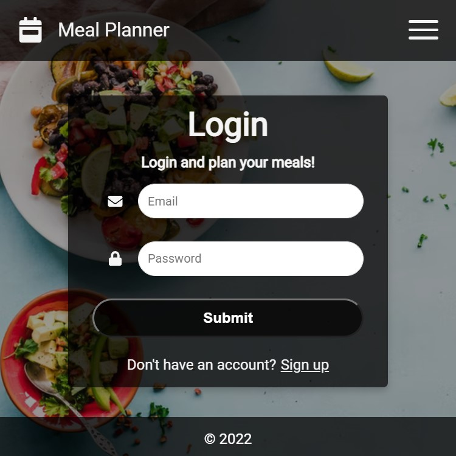

# Meal Planner [Previous Heroku deployment]

An app designed to plan meals for the week as well as store recipes for said meals in a database.



## Run

Clone the repository, then...

```bash
# Install backend dependencies
$ npm install

# Install frontend dependencies
$ cd frontend
$ npm install

# Run both backend/frontend with concurrently
$ npm run dev
```

## Use

Click on the Register button and fill out the form to create a user account. Then add meals by clicking on the 'Add Meal' button and add the recipe for the meal if you choose to.

## Note

Customized from a course project with Traversy Media to further my learning of the MERN stack. I customized it as a meal planner, rebuilt the UI, components, schema, and added update functionality to both front and back end
